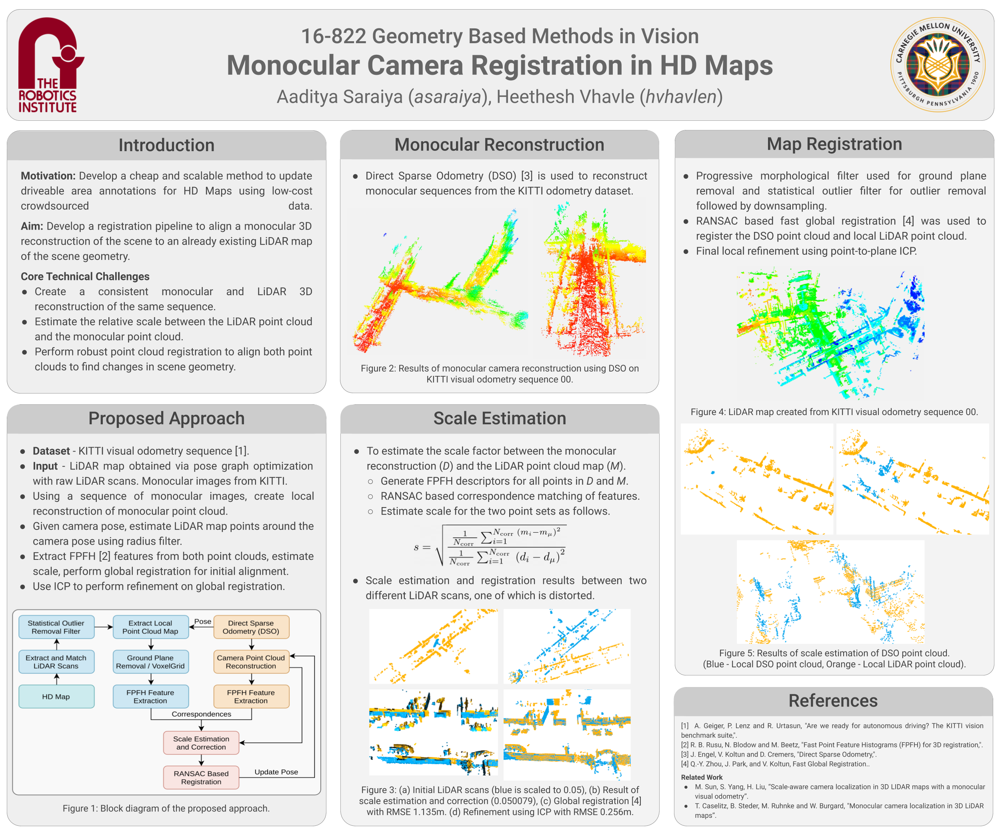

# Argoverse HD Map Updator
CMU 16-822 Geometry Vision Project - Updating HD map information with data from smartphones.

## About
High Definition (HD) maps are an important commodity for modern self-driving car companies as they are useful to precisely localize in the city. Modern datasets such as the Argoverse dataset [1], annotate the driveable areas in the map data. However, the driveable areas need to be constantly updated with changing conditions of a city. Construction zones can pop up, accidents can occur, or weather can affect road conditions — all of which can cause lane closures or other obstructions to a routine drive. The current solution is to collect similar high definition data using special purpose vehicles regularly to update the changes. However, this solution is costly, especially for large-scale mapping in multiple cities. Instead, we propose a low cost  solution which aims to update the driveable area of HD maps using crowd-sourced images taken from a smartphone.

## Poster

## References
1. Ming-Fang Chang, John W Lambert, Patsorn Sangkloy, Jagjeet Singh, Slawomir Bak, Andrew Hartnett, De Wang, Peter Carr, Simon Lucey, Deva Ramanan, and James Hays. Argoverse: 3D Tracking and Forecasting with Rich Maps. In Conference on Computer Vision and Pattern Recognition (CVPR), 2019.
2. A. Geiger, P. Lenz and R. Urtasun, "Are we ready for autonomous driving? The KITTI vision benchmark suite,".
3. R. B. Rusu, N. Blodow and M. Beetz, "Fast Point Feature Histograms (FPFH) for 3D registration,".
4. J. Engel, V. Koltun and D. Cremers, "Direct Sparse Odometry,".
5. Q.-Y. Zhou, J. Park, and V. Koltun, Fast Global Registration..
6. M. Sun, S. Yang, H. Liu, “Scale-aware camera localization in 3D LIDAR maps with a monocular visual odometry”.
7. T. Caselitz, B. Steder, M. Ruhnke and W. Burgard, "Monocular camera localization in 3D LiDAR maps”.
